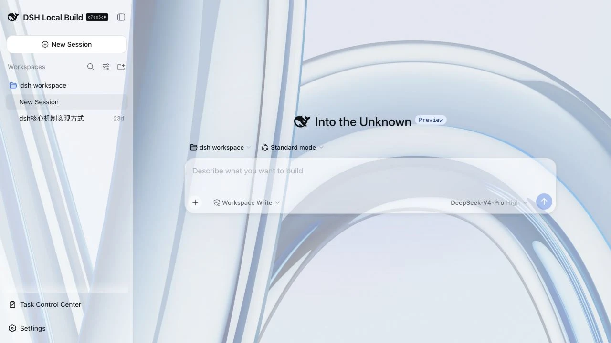
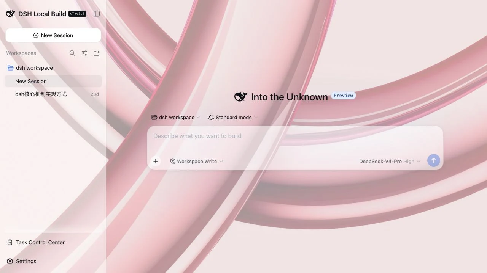
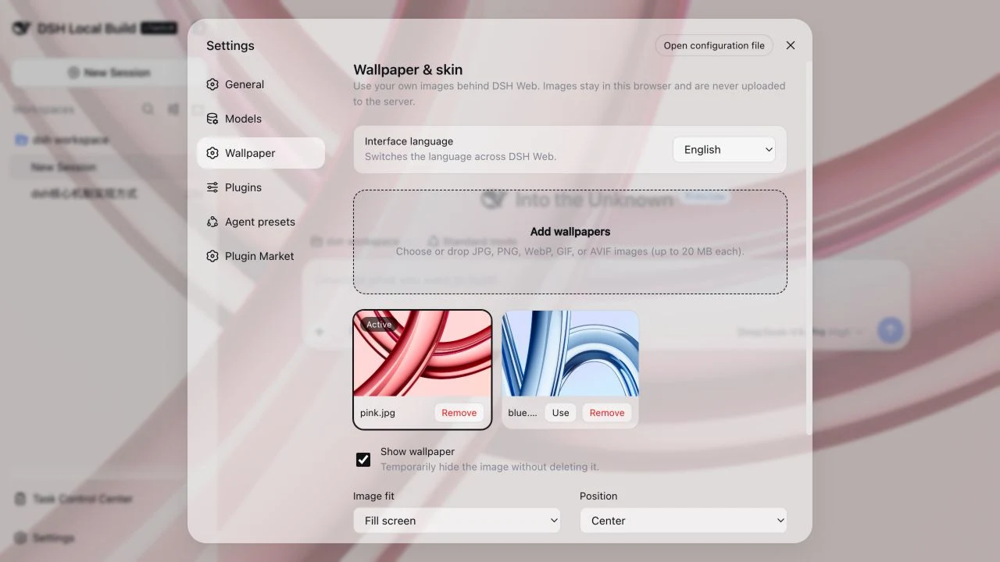

# dsh-custom-skin

<p align="center">
  DeepSeek Harness Web 的自定义壁纸与半透明皮肤插件。
</p>

<p align="center">
  <a href="./README.md">English</a> · <strong>简体中文</strong>
</p>

<p align="center">
  
</p>

## 功能

- 上传或拖入多张本地图片，并一键切换。
- 显示或隐藏壁纸、删除单张图片，或清空整个图片库。
- 调整图片填充、位置、遮罩、模糊和面板透明度。
- 自动适配 DSH 的亮色与暗色主题。
- 图片保存在当前浏览器的 IndexedDB，偏好保存在 localStorage，不会上传到 DSH 服务端。

## 效果预览

<p align="center">
  
</p>

<p align="center">
  
</p>

## 安装到 DSH Web

在 DeepSeek Harness 仓库中执行：

```sh
pnpm dsh plugin --profile web add github:SLin-code/dsh-custom-skin
pnpm dsh web
```

打开 Web 页面左下角的“设置”，进入“个性化”即可添加壁纸。

如需安装本地开发版本：

```sh
pnpm dsh plugin --profile web add "/absolute/path/to/dsh-custom-skin"
pnpm dsh web
```

卸载插件：

```sh
pnpm dsh plugin --profile web remove dsh-custom-skin
```

## 从源码构建

环境要求：Node.js 22.19 或更高版本，以及 pnpm 11.7.0。

```sh
pnpm install
pnpm build
pnpm check
```

仓库已经包含构建后的 `lib/` 文件，普通本地安装不需要再次构建。

## 数据与限制

- 每张图片最大 20 MB，最多保存 24 张；浏览器存储配额可能使实际容量更低。
- 壁纸按浏览器和站点 origin 隔离。在另一个浏览器、端口或远程地址打开 DSH 时，需要重新添加图片。
- 清理该站点的浏览器数据会同时清除已保存的壁纸。

## 许可证

[MIT](./LICENSE)
